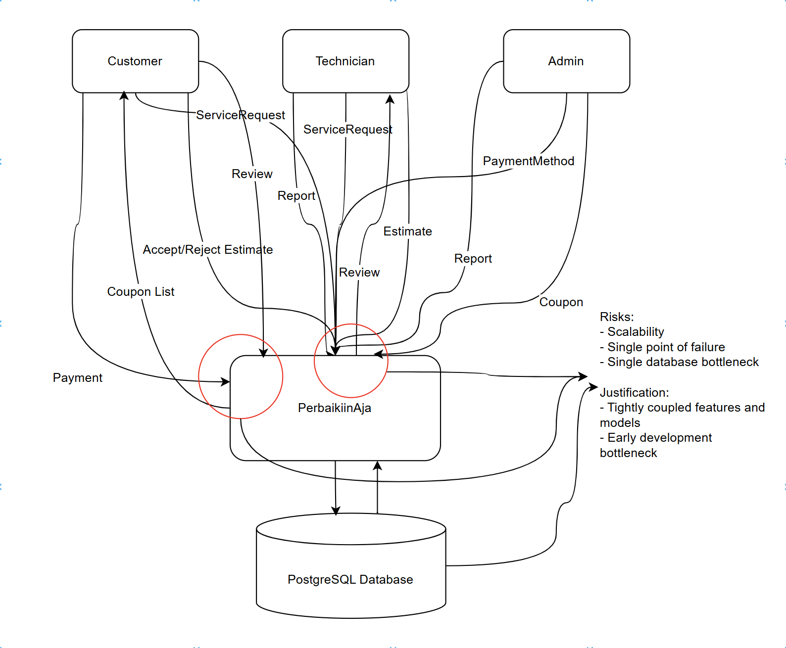
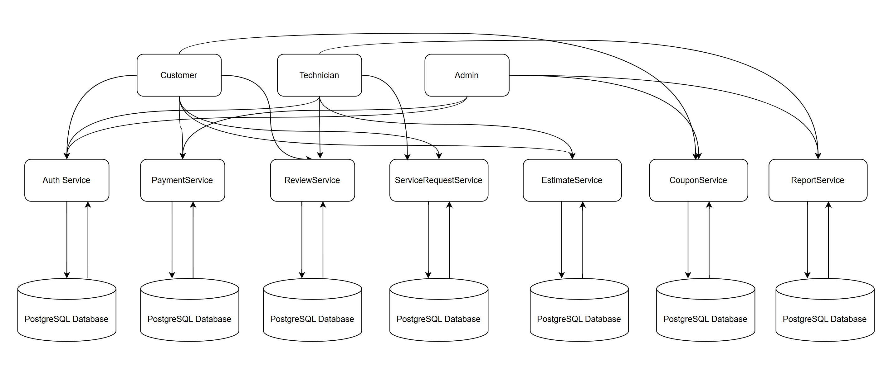
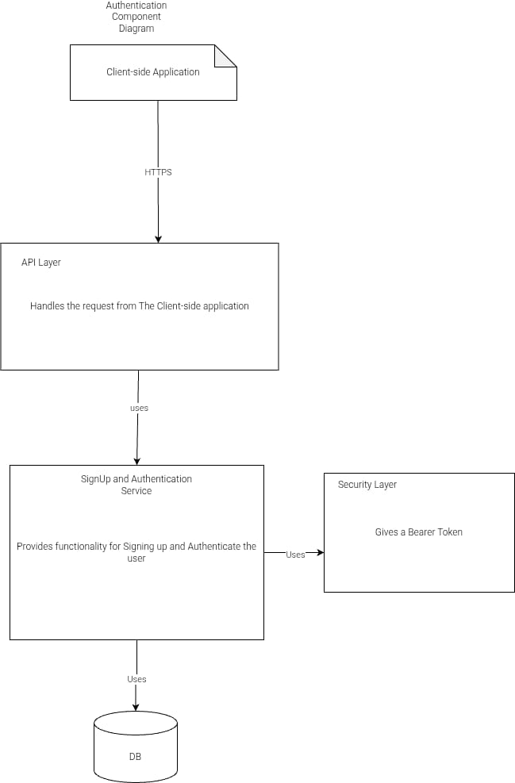
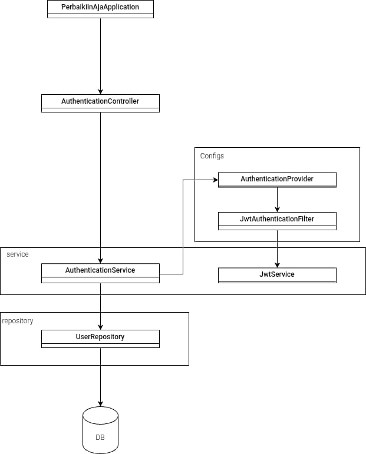

# perbaikiin-aja

## Main App

**Context Diagram**

**Container Diagram**

## Risk Analysis

Current architecture

Future architecture (**Asumsi: Arsitektur diterapkan setelah TK**)

Risk analysis:
Arsitektur monolitik yang digunakan pada desain saat ini (current architecture) menunjukkan beberapa risiko signifikan yang perlu diperhatikan. Pertama, masalah skalabilitas menjadi kendala utama karena semua fitur dan fungsi berada dalam satu aplikasi terpusat. Dengan pendekatan ini, PerbaikiinAja menghadapi risiko single point of failure yang tinggi, dimana kegagalan pada satu komponen dapat mematikan seluruh sistem. Database tunggal PostgreSQL juga menjadi bottleneck potensial ketika jumlah transaksi dan pengguna bertambah. Selain itu, fitur-fitur yang terikat erat satu sama lain (tightly coupled) akan menyulitkan pengembangan dan pemeliharaan sistem dalam jangka panjang, karena perubahan pada satu komponen dapat berdampak pada komponen lainnya.

Arsitektur mikroservis yang diusulkan (future architecture) menawarkan solusi untuk mengatasi risiko-risiko tersebut. Dengan memisahkan fungsionalitas ke dalam layanan-layanan independen (AuthService, PaymentService, ReviewService, dll.), sistem menjadi lebih tahan terhadap kegagalan karena masalah pada satu layanan tidak akan memengaruhi keseluruhan sistem. Setiap layanan memiliki database PostgreSQL sendiri, yang secara signifikan mengurangi bottleneck database dan meningkatkan skalabilitas horizontal. Pendekatan ini juga mendukung pengembangan yang lebih cepat dan independen, di mana tim yang berbeda dapat bekerja pada layanan yang berbeda tanpa risiko konflik integrasi yang tinggi. Isolasi ini juga memungkinkan teknologi dan skala yang berbeda untuk diterapkan sesuai dengan kebutuhan spesifik setiap layanan.

Meskipun arsitektur mikroservis menawarkan banyak keunggulan, implementasinya juga menimbulkan risiko baru yang perlu diantisipasi. Kompleksitas operasional akan meningkat dengan adanya banyak layanan dan database yang perlu dikelola dan dipantau. Latensi komunikasi antar layanan dapat menjadi masalah jika tidak dirancang dengan baik, terutama untuk transaksi yang melibatkan beberapa layanan (misalnya proses pembayaran yang melibatkan ServiceRequestService, PaymentService, dan CouponService). Konsistensi data juga menjadi tantangan karena data tersebar di beberapa database, yang dapat menyebabkan inkonsistensi jika tidak ditangani dengan mekanisme seperti saga pattern atau transaksi terdistribusi. Untuk mengurangi risiko-risiko ini, disarankan untuk menerapkan sistem observability yang komprehensif, strategi circuit breaker untuk menangani kegagalan layanan, dan metode sinkronisasi data yang handal antar layanan. Selain itu, set up database dan ci/cd pipeline menjadi bottleneck tersendiri dalam tahap development awal atau early development phase

## Features

## Authentication

Component Diagram 

Code Diagram 

## Fitur 2 dan 3 (karena component dan code saling overlap)

Component Diagram

Code Diagram

## Review

**Container Diagram**

* **Front End (React.js)**

  * Delivers static content to users.
  * Handles review-related actions:

    * Posting reviews after service completion (POST).
    * Viewing technician reviews (GET).
    * Modifying existing reviews (PUT).
    * Delete existing review (DELETE)

* **Back End (Spring Boot REST API)**

  * Provides API endpoints for communication between frontend and database.
  * Handles JSON-based requests and responses.
  * Key endpoints:

    * `/reviews` - General review operations.
    * `/reviews/{id}` - Access or modify specific reviews.
    * `/reviews/technician/{technician_id}` - Fetch reviews for a specific technician.

* **Database (PostgreSQL)**

  * Stores review entities, including ratings and comments.
  * Supports data persistence for efficient role-based interactions.
  * Integrates with the backend for reading and writing review data.

## Payment Method
**Container Diagram**

**Code Diagram**

