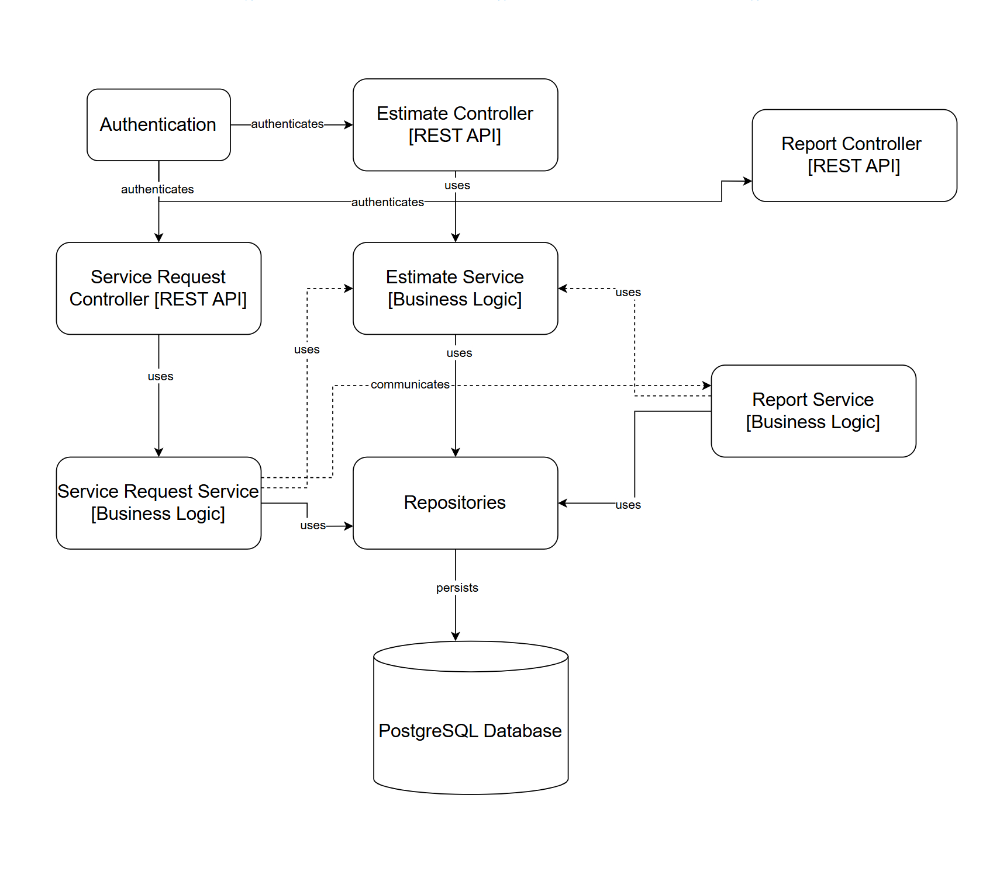
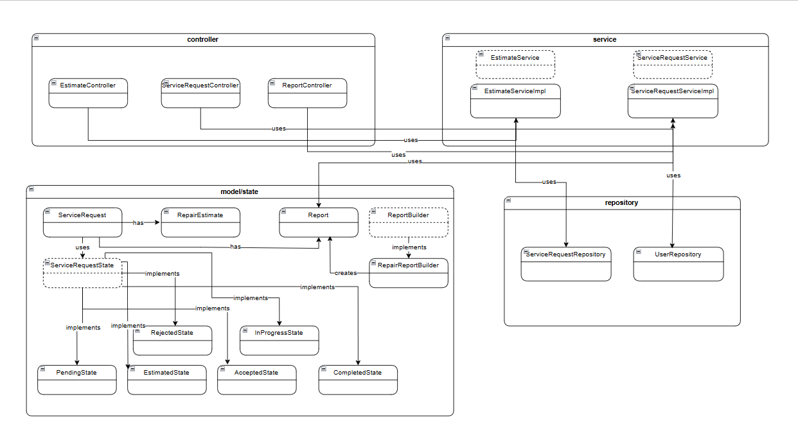
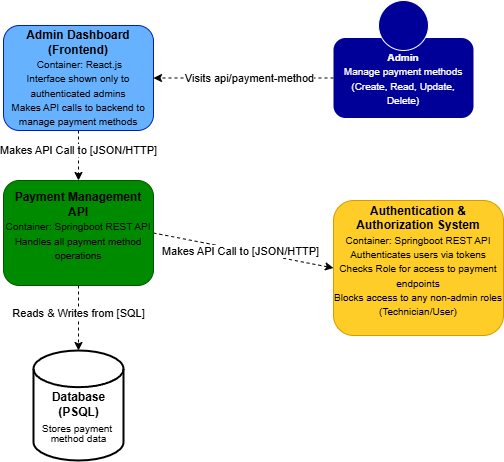
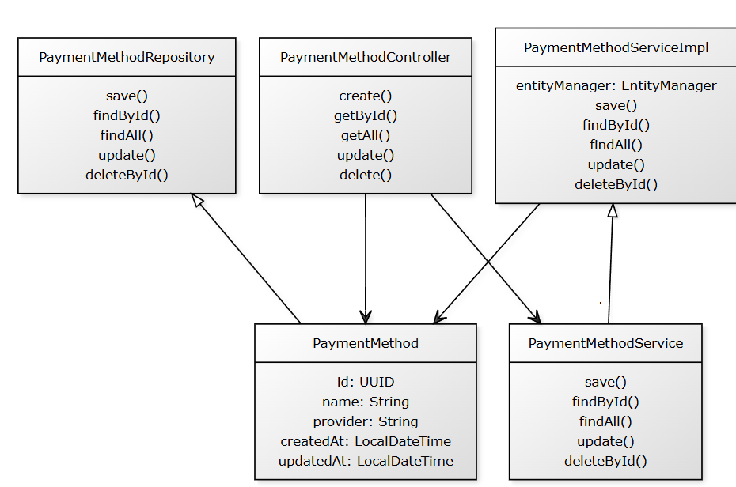

# perbaikiin-aja

## Main App

**Context Diagram**

**Container Diagram**

## Features

## Fitur 2 dan 3 (karena component dan code saling overlap)

Component Diagram

Code Diagram

## Review

**Container Diagram**

* **Front End (React.js)**

  * Delivers static content to users.
  * Handles review-related actions:

    * Posting reviews after service completion (POST).
    * Viewing technician reviews (GET).
    * Modifying existing reviews (PUT).
    * Delete existing review (DELETE)

* **Back End (Spring Boot REST API)**

  * Provides API endpoints for communication between frontend and database.
  * Handles JSON-based requests and responses.
  * Key endpoints:

    * `/reviews` - General review operations.
    * `/reviews/{id}` - Access or modify specific reviews.
    * `/reviews/technician/{technician_id}` - Fetch reviews for a specific technician.

* **Database (PostgreSQL)**

  * Stores review entities, including ratings and comments.
  * Supports data persistence for efficient role-based interactions.
  * Integrates with the backend for reading and writing review data.

## Payment Method
**Container Diagram**

**Code Diagram**

